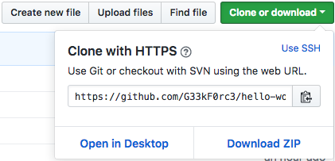

# Hello World!

Good, you are finally here. This is your personal, **Hello World** repository. Inside of it, you are going to create two different Hello World Projects, one in HTML and one in Javascript.

### Prerequisites

Of course, you can just start coding, but for an enjoyable experience, you'll need some tools. And that is the reason why this README file exists.

##### 1. Get yourself a text editor
As you might already know, you can't just write code in Word or Pages. Code needs to be written in something called "Plain Text". Plain text is text without any formatting, just text.

I recommend you to use [Atom](https://atom.io/) as your text editor, it's free.

##### 2. Javascript Node
To run Javascript outside of your browser, we need something called "Node". Node is a JavaScript runtime, we'll teach you more about it later.

##### 3. Git
This whole project is managed with [Git](https://git-scm.com/). Git is a version control system, by keeping track of historical points of the project, allows people to collaborate while keeping track of who did what. Simple.

I recommend you to use [GitHub Desktop](https://desktop.github.com/) for this, as it has a painless integration with GitHub.

### Cloning the repo

#### ...with GitHub Desktop

> TODO: @Gerd, add steps for GitHub Desktop

#### ...with the command line

If you want to experiment with the command line, go ahead, no one's stopping you.
launch the Terminal application on you Mac, you will be greeted with Bash:

##### 1. check you have `git` installed.

Type the following without `$`, the dollar sign is there to signify the beginning of a command.
for the below line you want to type `which git`.
```bash
$ which git
```

If anything is printed, awesome, you can continue. Otherwise, you will need to [install `git`](https://codeburst.io/installing-git-for-the-first-time-on-mac-osx-bf9c513af2b8) first.

##### 2. where'd you like to keep this project?

Using the `cd`, _change directory_, command, you can navigate to anywhere in the file system. 
> note: directories are commonly referred to as folders

Say I'd like to keep my project in `geek-force` folder in `Documents`, I can navigate there by:
```bash
$ cd Documents/geek-force
```

You can check if you're in the right spot by asking the shell to _print the working directory_
```bash
$ pwd
/Users/jessicawan/Document/geek-force
```

##### 3. clone the repository from GitHub

you can clone this repository through `https`, exact URL can be found on its Github page:

```bash
$ git clone https://github.com/G33kF0rc3/hello-world.git
```
---

### HTML Hello World

First, we got to open your project folder inside of atom. Once you opened atom, press `⌘+⇧+O` to open a new project and navigate to where you cloned your project to. You can close all tabs that open. In the sidebar, you should be able to see five things:
- one `.git` folder
- a `.gitignore` file
- one `html` folder
- one `js` folder
- this `Readme.md` - now you can choose to continue reading this tutorial inside of Atom by opening it with Markdown Preview, which you can get by pressing `⌘+⇧+P` for the command palette and searching for `Markdown Preview: Toggle`.

We are going to edit the only file in the html folder. Open it up!

You should see something like
```html
<html>
    <head>
        <title>Hello World!</title>
    </head>
    <body>
        <!-- insert your hello world after this line -->

    </body>
</html>
```

This is the basic structure of an HTML file, it consists of any depth of nested elements, the word "hierachical" might come to mind. Most elements consist of an opening tag, enclosed in `<>`,  content (which can include more elements) and a closing tag, which is the opening tag with a `/` added after `<`.

The `html` tag encapsules head and body. Everything inside of `body` is going to be rendered onto the page, while everything in the `head` tag are additional information you supply the browser. In this case, the `title` tag tells the browser the title of the page (pretty self-explanatory), which is typically displayed as the name of the tab.

Now, right below the comment, add "Hello World" into the file. Then save (`⌘+S`) and navigate to the file in Finder. Double click it, or choose to Open With your browser. You should see `Hello World` is now displayed on the page.

Congratulations! You have just made your first Hello World!

You might have noticed the content of Line 6 is not displayed, that's because it's a comment, wrapped between `<!--` and `-->`. Comments are meant as notes for people authoring and editing the web page, like you and I.

You can try the same with `<p>Hello World!</p>` and `<h1>Hello World!</h1>`.

> Don't go around telling people you program, yet. HTML is a markup language, not a programming language.

---

### Formatting Text

Now, there are a lot more you can put into body to have browsers display than short messages. For instance, anything formatting word processors, like Microsoft Word, support, you can express in an HTML document with tags as well.

As a demostration, we're going to author a short recipe page in HTML, the text is provided in `recipe.txt` in `assets` folder, open it up! This recipe may seem very plain and boring right now, but we're going to make it better with some HTML markup.

##### headings, subheadings, sub-subheadings, ..., sub-sub-sub-sub-sub-subheadings

First, let's change the content of our title tag in the head to reflect the content of our page
```html
<title>Awesome Garlic Bread Recipe</title>
```

Correspondingly, we can use a Level 1 heading to display the same title on our actual page, to do so, add the following in `body`
```html
<h1>Awesome garlic bread!</h1>
```
`headings` are one of the most basic elements. They range from level 1 to 6, `h1` being the main heading, `h2` being subheadings, `h3` is sub-subheadings...

Similarly, we can add in other subheadings for our page for other headings, I see the following as a good structure for this recipe page:
```html
<h1>Awesome garlic bread!</h1>
  <h3>Stats</h3>
  <h3>Nutritional Facts</h3>
  <h2>Ingredients</h2>
  <h2>Directions</h2>
```
It is often times okay to not nest headings in the exact consecutive order of their levels, but you should, whenever possible.

##### (un)ordered lists  
_i.e. bullet lists and numbered lists_

Next, we want to list out our directions sequencially, with numbering, like this:
```html
<ol>
  <li>Preheat oven to 350 degrees F (175 degrees C).</li>
  <li>In a small saucepan over medium heat, melt butter and mix with garlic powder and dried parsley.</li>
  <li>Place Italian bread on a medium baking sheet. Using a basting brush, brush generously with the butter mixture.</li>
  <li> Bake in the preheated oven approximately 10 minutes, until lightly toasted. Remove from heat. Sprinkle with mozzarella cheese and any remaining butter mixture. Return to oven approximately 5 minutes, or until cheese is melted and bread is lightly browned. </li>
</ol>
```

`ol` stands for ordered list _(commonly appearing as numbered list)_, there is also `ul`, unordered list _(commonly appear as bullet list)_.

Inside of lists, you can put `li`, list items. Here we have put each step inside of a 

> - TODO: a task

##### reference
[Mozilla's HTML Cheatsheet](https://developer.mozilla.org/en-US/docs/Learn/HTML/Cheatsheet) includes common tags you might want to use to format text. For anything else, like a table, don't be afraid to look it up!

---

### Adding Cool Elements

But before we leave you in the world of tags, you should know of a few concepts to check against for sanity:

##### 1. block vs inline element
- Block level elements form a visible block on a page, they will appear on a new line from content before, and any content after will also appear on a new line. These tend to be structural elements on the page, elemets like `<p>` (paragraph), lists, navigation menus.
- Inline elements surround only small parts of content, typically inside a paragraph of text, for example, `<a>` element (hyperlink) or emphasis elements such as `<em>` or `<strong>`.

Simply put, inline elements can be nested in block elements, while block elements are not allowed to be nested in inline elements.

##### 2. empty elements
Some elements need not to have content to function, such as when embedding an image:
```html

```
In which case, only the opening tag is needed, serving as a placement archor.

##### 3. attribute
You also see that this tag has an attribute, which are extra information placed inside of the opening tag. Most attributes are specified in key-value pairs, the possibly keys vary depending on the specific element, and the value always have to be enclosed in `""`. Here we are specifying the source of the image to be embedded in in URL. 
<!-- We can also specify location of the desired image relative from this very HTML file, if we wanted to include a file which does not exist elsewhere. -->

Great! Now you can do some serious coolness with HTML markup!

> - TODO: task
> - TODO: reference
